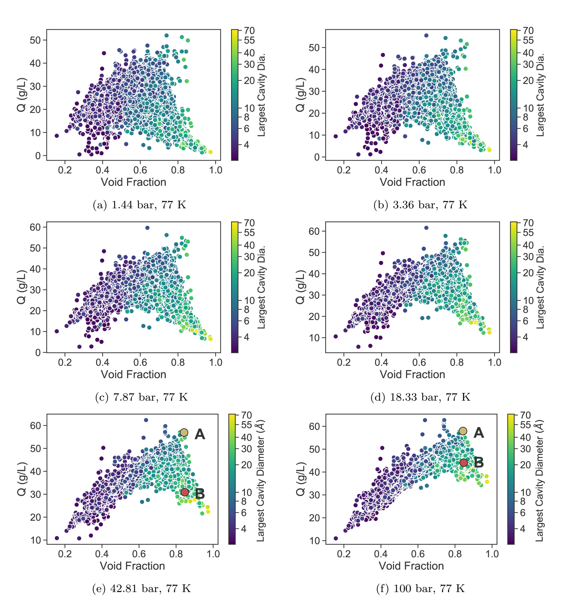

.. _examples:

===============================================================
Examples
===============================================================

Here we provide a few simple examples on using the different functionalities offered by PyIsoP. There are more options
available to the individual functions than the ones demonstrated here. Please refer to the corresponding API reference to 
find more about the modules and functions and the possible options.

.. _grid:

Energy Grid Calculation
================================================

PyIsoP can compute energy grids using the grid calc or the grid_calc_dask (recommended) functions from the :ref:`grid3D` module. The functional forms for the interatomic potentials (Eg. Lennard-Jones) are defined
in the :ref:`potentials`  module and the force field parameters are read by the :ref:`forcefields` module into an instance. Please take a look at 'pyIsoP\\forcefield\\UFF\\force_field_mixing_rules.def' file
on GitHub for a example on specifying LJ parameters for use with PyIsoP. You will see that the formatting is very similar to that of RASPA_ except for the '_' often used in atom typing.

.. _ grid_calc:

1. Calculation using Numba_ (serial)
------------------------------------------
This is an older implementation that  uses vectorized_ from Numba_ for computing energy grids quickly on a single CPU (multi-threading).
Although orders of magnitude faster than 'for' loops, this implementation lacks in scalability and algorithmic efficiency. It is still quite useful
if you do not want to install Dask or if you want the output grid directly as a Numpy array and not as a lazy-evaluated Dask array.
However, if you are calculating a fine grid, the resultant array may not fit into your RAM. The Dask option is recommended for such out-of-memory calculations.

.. code-block:: python
       
        import pyIsoP.grid3D as grid3D
        import pyIsoP.potentials as potentials
        import pyIsoP.forcefields as forcefields
        import pyIsoP.writer as writer

        ####################################################################
        # Calculate the grid
        t1=grid3D.grid3D('ZIF-4_mod.cif',spacing=0.5)          # Intialize grid3D object
        f1=forcefields.forcefields(t1, forcefield='C:/PyIsoP/forcefield/UFF', sigma=3.95, epsilon=46)      # Update the force field details to grid obj. t1
        t1= grid3D.grid3D.grid_calc(t1,"lj",f1)                          # Overwrite the existing object with computed 3D grid.

        # Save coordinates for visualizing later
        writer.writer.write_vts(t1,'zif-4_grid')                   # Write a binary vtk file
        writer.writer.write_frame(t1,'zif-4_repeat.pdb')    # Save the corresponding replicated structure corresponding to a 12.8 A (default) cut-off.

.. _grid_calc_dask:

2. Energy Grid Calculation using Dask_ (serial or paralllel)
------------------------------------------------------------
PyIsoP uses Dask_ to compute energy grids in parallel (multi-threading or over many CPUs) such that it will work on your tiny laptop 
or a High Performance Cluster (HPC) with no or little additional coding on your part. This facilitates super-fast calculation of fine grids
and/or even high-throughput screening of materials in an interactive fashion, just as if you were working on your local machine. 

We have to initialize a client for Dask depending upon the machine you want to use to compute the grid. 

        2.1 **Working on your laptop (1 CPU)**: No need to do anything, Dask will automatically recognize your cores and use multi-threading. No overhead will occur from making copies and transfering information between workers.

        2.2 **Working on an HPC (many, many CPUs)**: You have to start a mini-cluster with your processor and memory requirements and set that as your client. Here's an example on an HPC that uses SLURM as the job-scheduler

        .. code-block:: python

                from dask_jobqueue import SLURMCluster # My HPC uses SLRURM
                from dask.distributed import Client         # Client class
                
                cluster=SLURMCluster(cores=4, interface='ib0', project='p#$###', queue='short', walltime='04:00:00', memory='100GB') # This is one 'job' or worker, it has 4 CPUs.
                cluster.scale(25)  # We are starting 25 such workers, a total of 100 CPUs
                client= Client(cluster) # Use the mini-cluster as the client for our calculations.

For many other options on setting up Dask, including HPCs, please refer to the Dask setup_ documentation.

.. _setup: https://docs.dask.org/en/latest/setup.html

The rest of the code is very similar to that from before, except ...

.. code-block:: python
       
        import pyIsoP.grid3D as grid3D
        import pyIsoP.potentials as potentials
        import pyIsoP.forcefields as forcefields
        import pyIsoP.writer as writer

        ####################################################################
        # Calculate the grid
        t1=grid3D.grid3D('ZIF-4_mod.cif',spacing=0.5)          # Intialize grid3D object
        f1=forcefields.forcefields(t1, force_field='C:/PyIsoP/forcefield/UFF', sigma=3.95, epsilon=46)      # Update the force field details to grid obj. t1
        grid_dask = grid3D.grid3D.grid_calc_dask(t1,f1)                          # Returns the grid as a Dask array.

the energy grid (`grid_dask` in the example above) returned now is a lazy-evaluated Dask array,
with all the rules and element formulae embedded within. To evaluate it and append your grid object use

.. code-block:: python
        
        # To evaluate it and append your grid object then and there, we can't do anything else unless evaluation is complete.
        t1.pot = grid_dask.compute()

        # To evaluate in the background. We can continue adding rules to the array while the array is being 'persisted'.
        client.persist(grid_dask) # Starts in the background on an HPC.
        grid_dask = grid_dask + 1.2345678 # Continue doing things to the array, just a silly example.

Please refer to Dask documentation for all the possibilities using Dask-clients_ and Dask-arrays_.

.. _Dask-clients: http://distributed.dask.org/en/latest/client.html
.. _Dask-arrays: https://docs.dask.org/en/latest/array.html

Bonus Example: Interactive, Scalable and High-throughput 
-----------------------------------------------------------

Dask-bags_ are ideal for performing the same function on many items (files, folders etc) in parallel, as long as the order of the bagged items is unimportant.
Since Dask is already scalable and interactive, PyIsoP can be readily extended to high-throughput calculation of energy grids (or isotherms) using Dask-bags.  

.. code-block:: python
        
        ####################################################################
        # This function computes and returns the energy grid as a Dask array
        ####################################################################
        def compute_grid_pyisop_dask(cif, spacing=0.5):
                from pyIsoP import grid3D, forcefields
                import numpy as np
                t1=grid3D.grid3D(cif)          # Intialize grid3D object
                f1=forcefields.forcefields(t1, force_field='/home/agp971/pyIsoP/forcefield/UFF', sigma=3.95, epsilon=46)      # Update the force field details to grid obj. t1
                grid_dask = grid3D.grid3D.grid_calc_dask(t1,f1)  # Computes the grid as a Dask array.
                return grid_dask.compute()               # Returns the grid as a Numpy array here itself, only because we are saving space by wrapping things in dask bags later anyway.

        ##############
        # Main code
        ##############
        import dask.bag as db # Import the Dask-bags class
        import glob   # To dig up a bunch of cif files

        cif_list = glob.glob('**/*.cif', recursive=True)                              # Grab all the CIF files in the current folder
        many_grids=db.from_sequence(np.array(cif_list)).map(compute_grid_pyisop_dask) # Apply the function to all the items
        many_grids.persist() # start the calculations in the background, returns a future.
        
        
        # To print all the grids as numpy arrays use
        many_grids.compute()

        # To print any one (for example the first grid) use.
        many_grids.compute()[0]
        
        

        # Or create a new grid3D object for any of the CIFs (first entry chosen below) and save the energy grid there there
        t1=grid3D.grid3D(cif_list[0])          # Intialize grid3D object
        t1.pot = many_grids.compute()[0]       # Stored the desired grid into the grid3D object

        # Like before, you can also write this into a binary VTK (.vts) file for visualization while specifying the number of unit cells along each direction.
        from pyIsoP import writer
        writer.writer.write_vts(grid_obj=t1, path_to_file='some_filename', nx_cells=2, ny_cells=2, nz_cells=2)

4. Benchmarking on a Fine Energy Grid
--------------------------------------

Let's try computing the energy grid for Cu-BTC which has a simple-cubic unit cell and an edge length of 26.343 angstroms. Our mini-cluster consists of one or more workers, where each worker (or job) consists of 4 CPUs and a memory
of 100 GB (only a small fraction of which will be used here). Since parallel computing involves many stages of information reading, writing and transfer added atop the actual computing time,
only the total time is plotted here. We choose a rather fine grid of 0.1 angstrom spacing (**263x263x263=18,191,447 grid points**) and compute it 
by employing 10 (40 CPUs), 20 (80 CPUs), 25(100 CPUs) and 30 (120 CPUs) workers respectively with each worker having a maximum memory of 100 GB. We see that even at 120 CPUs, the total 
computation time continues to drop linearly, which indicates that we haven't hit the point of diminishing returns yet, at least for this fine of a grid on this material. 

..    :height: 300
..    :width: 400

.. We can mimic high-throughput screening by computing the same grid multiple times. It took
.. ** min s ** to compute 0.5 angstrom grid (which is sufficient for predicting isotherms accurately using PyIsoP) for Cu-BTC 30 times in parallel using a mini-cluster of 25 workers (100 CPUs).
.. The performance may vary depending upon your read/write speeds on your hardware, the number of CPUs per node, the memory available per CPU and the speed of information transfer between workers. We
.. encourage users of PyIsoP to benchmark their test calculations on their own machines before performing full-fledged high-throughput screening.

.. _Dask-bags: https://docs.dask.org/en/latest/bag.html

.. _after_thoughts:

Notes:
--------

        -- Newer versions PyIsoP do not return the x, y, z values as 3D grids, this is simply to save space. Although you can use Numpy's meshgrid_ function to generate these from a grid object 't1' with one line of code
                
        .. code-block:: python

                import numpy as np
                x3d, ,y3d ,z3d = np.meshgrid(t1.x_grid, t1.y_grid, t1.z_grid, indexing='ij')

        -- The grid is calculated over one unit cell. If you'd like to replicate it to say 2x2x3 please use the tile_ function from Numpy to repeat the grid in blocks.

        .. code-block:: python

                import numpy as np
                repeat_grid = np.tile(t1.pot, (2,2,3)) # Let's say you need 2x2x3 for making into VTK.

        -- There is this one popular_strategy_ of using Numba inside Dask to get a massive speed improvement for some algorithms. Unfortunately, the current algorithm requires an array shape change, which prohibits the use of Numba on top of the parallel Dask algorithm. However, the current code is still quite fast. See the benchmarking graph above.

.. _popular_strategy: https://towardsdatascience.com/how-i-learned-to-love-parallelized-applies-with-python-pandas-dask-and-numba-f06b0b367138
.. _meshgrid: https://docs.scipy.org/doc/numpy/reference/generated/numpy.meshgrid.htm
.. _tile: https://docs.scipy.org/doc/numpy/reference/generated/numpy.tile.html

.. _pores:

Pore Structure Visualization
===========================================

The binary vtk file can be used to visualize and elucidate complex pore structures. 
There are many softwares which can create volume and isosurface rendering from a vtk file. The image below is generated using Visit_ visualizer.
We illustrate the complex pores of ZIF-4 using two isosurfaces at 20000 K (silver) and 0 K (brown).

.. figure:: ./images/zif-4.png
   :align: center
   :height: 400
   :width: 400

   

.. _histo:

Energy Histogram
===========================================

PyIsoP contains the :ref:`histogram` which offers 3 ways for the user to obtain the energy histogram.  The number of bins and :math:`E_{max}` can be set while initializing the histogram.
All the energies should be in the units of [K] to ensure consistency with the RASPA_ grid output.

1. From the PyIsoP  :ref:`grid3D` object 

.. code-block:: python

        import pyIsoP.histo as histo                 # import the histogram module
        h = histo.histo()                                     # initialize a histo object
        h = histo.histo.grid2histo(t1, h)            # update (overwrite) the histo object with histogram calculated from the grid3D object t2  

2.  Read in the energy grid from a RASPA_ style .grid file, with x, y, z, E data or from  .cube file. 

.. code-block:: python

        import pyIsoP.histo as histo                 # import the histogram module
        h = histo.histo()                                     # initialize a histo object
        h = histo.histo.raspa2histo('raspa_grid_filename.grid' , ,h)            # update (overwrite) the histo object with histogram calculated from the RASPA grid file.
        h = histo.histo.cube2histo('cube_filename.cube',h)            # update (overwrite) the histo object with histogram calculated from a .cube file

3. Read in the histogram as two column text file with no header. Bin-centers in one column,  normalized histogram in the other column.

.. code-block:: python

        import pyIsoP.histo as histo                 # import the histogram module
        h = histo.histo()                                     # initialize a histo object
        h = histo.histo..file2histo('text_filename.dat', h)            # update (overwrite) the histo object with histogram calculated from the RASPA_ grid file.

.. _machlearn:

Coordination Number from Machine Learning
===========================================

In order to predict the guest-guest energy of hydrogen, we use a machine learning model (GPR) trained on the first-shell coordination number.
Please refer to :ref:`theory` section or our recent work by Gopalan *et al.*, :cite:`gopalan2019fast`  for more details. PyIsoP provides 
a pre-trained model at 77 K which can predict the hydrogen coordination numbers as a function of  log :math:`_{10}` (P), void fraction, largest cavity diameter (A), pore limiting diameter (A)]

-   To load that model (details are in the  SI of the publication :cite:`gopalan2019fast` 

.. code-block:: python

        import joblib
        gp=joblib.load('gprmodel.joblib')               # Load the trained model
        n1 = gp.predict([logP, VF, LCD,PLD])           # Predict at 77 K for a set of  feature values for log10(pressure), void fraction, LCD and PLD in angstroms.

-   To train a new model using your own data (at your temperature of choice)  but with the default settings using Gaussian Process Regression, create a comma-separated-values (.csv) with 5 columns of "log(P)", "Vf", "lcd", "pld", "n1" with no header lines. Let's call it 'file_with_data.csv'

.. code-block:: python

        import pyIsoP.machlearn as machlearn

        m1= machlearn.machlearn(restarts=2)                          # Initialize object with  2 optimizer restarts
        m1 = machlearn.machlearn.GPR4n1( m1, 'file_with_data.csv', 0.9)   # Train the model with 90 % training and 10 % Testing
        n1 = m1.predict([logP, VF, LCD,PLD])           # Predict at your temperature for a set of  feature values for log10(pressure), void fraction, LCD and PLD in angstroms.

-   Preferred:  To use algorithms other than GPR, users are encouraged to train their own model and be ready to provide :math:`n_1` as a vector (array corresponding to different pressures) to be fed into
    the isotherm_ calculation (example below) using the :ref:`predictor` .

.. _isotherm:

Adsorption Isotherm
===========================================
PyIsoP takes in the temperature, pressures, void fraction, the energy histogram object, coordination numbers vector, Lennard-Jones well depth in [K] (should be consistent with the one used in the grid calculation) and the molecular weight (:math:`M_A`)
and predicts the adsorption isotherm in the units of grams per liter of the adsorbent. Combining all the examples from above, the isotherm can be calculated using the :ref:`predictor` as 

.. code-block:: python

        from pyIsoP import predictor
        g_L_CH2=predictor.predictors.predict_isotherm(T,P,Vf,h,n1,epsilon=46,MA=14)

.. _screening:

Example Application to High-throughput Screening 
===================================================
CoRE-MOF 2019 All Solvent Removed (12,914 structures)
-------------------------------------------------------------------

Using the same algorithm implemented as PyIsoP, we calculated the hydrogen adsorption isotherms for a
preliminary version of the CoRE MOF 2019-ASR (12,914 structures) from 1 Pa to 100 bar at two
temperatures (77 K and 160 K) in less than 24 hrs on 500 processors with a grid spacing of 1 :math:`\mathring{A}`.
The evolution of the gas uptake for the entire set of 12,914 materials at 77 K with increasing adsorption pressures
is depicted in the figures below. Having the entire isotherm enables us to answer
important questions regarding maximization of gas uptake quickly and accurately, like determining
the choice of the adsorption and desorption conditions for a material with given void fraction and
LCD or against any other textural property. For example, consider two materials A (highlighted in
yellow in figures (e) and (f)) and B (highlighted in red in figures (e)
and (f)) with very similar void fractions, close to 0.85 but with different largest cavity
diameters of 13.5 :math:`\mathring{A}`  and 34.9 :math:`\mathring{A}`,  respectively. If one were to use A for storing hydrogen at 77
K, increasing the adsorption pressure from 42 bar \ref{fig:L5} to 100 bar \ref{fig:L6}) would give
an improvement of less than 1\% (56.939 g/L to 57.92 g/L) in gas uptake, hence is not worthwhile considering
the increased costs and risks of storing at higher pressures. Instead, if one were using B, the
same change in pressure will improve the the uptake by about 50\% (30.87 g/L to 44.065 g/L), which might be more
economically feasible. Please refer to Gopalan *et al.* :cite:`gopalan2019fast` for more information.

.. _vectorized: https://numba.pydata.org/numba-doc/dev/user/vectorize.html
.. _VisIt: https://wci.llnl.gov/simulation/computer-codes/visit/
.. _RASPA: https://github.com/numat/RASPA2
.. _Numba: http://numba.pydata.org/
.. _Dask: https://dask.org/

------------------------

.. bibliography:: mybibliography1.bib
