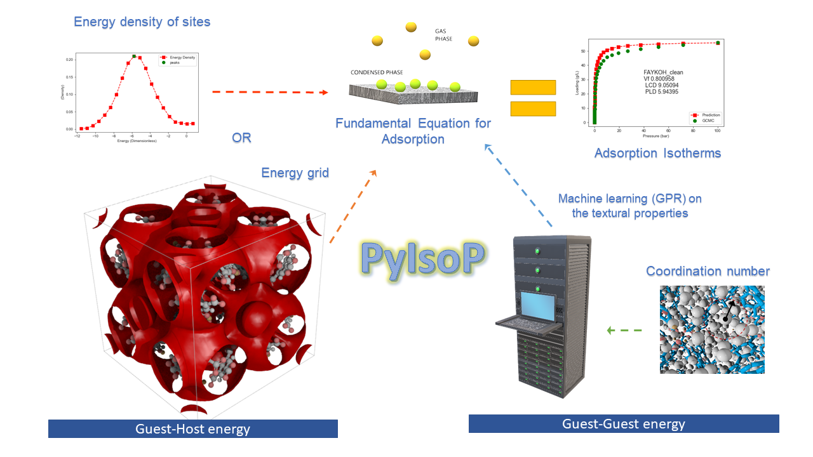

.. pyisop documentation master file, created by
   sphinx-quickstart on Thu Mar 15 13:55:56 2018.
   You can adapt this file completely to your liking, but it should at least
.. pyisop documentation master file, created by
   sphinx-quickstart on Thu Mar 15 13:55:56 2018.
   You can adapt this file completely to your liking, but it should at least
   contain the root `toctree` directive.

.. pyisop documentation master file, created by
   sphinx-quickstart on Thu Mar 15 13:55:56 2018.
   You can adapt this file completely to your liking, but it should at least
   contain the root `toctree` directive.

Python Isotherm Prediction (PyIsoP)
**************************************************
PyIsoP uses a fast and accurate, semi-analytical algorithm to calculate the adsorption of
single-site molecules in nanoporous materials using energy grids. The energy grid algorithm in PyIsoP is parallelized using 
Dask_ (python) such that PyIsoP will work just as well on your laptop (1 CPU, multi-threading) and 
on a High Performance Cluster (hundreds of CPU, multi-processing) with no or little additional 
coding on your part. The method itself is about 100 times faster compared to grand canonical Monte Carlo (GCMC) simulations, combined with the fast calculation of energy grids 
PyIsoP is ideal for obtaining quick estimates of adsorption and even interactive high-throughput screening of large databases. Although originally
developed for predicting hydrogen adsorption, the underlying algorithm can be readily applied to other
molecules which can also be modeled by a single-site (spherical probe) such as methane and noble gases. Since
the energy landscape of a material is usually independent of temperature [#f1]_, including thermal
swing into our calculations is also quick and easy. The energy grids can also be used to visualize and analyze complex pores in a materials
by choosing the right isoenergy contours from the energy landscape. Please refer to our documentation page on ReadTheDocs_ for theory, examples and the API reference.

.. image:: https://readthedocs.org/projects/pyisop/badge/?version=latest
    :target: https://pyisop.readthedocs.io/en/latest/?badge=latest&style=for-the-badge
    :alt: Documentation Status

.. image:: https://travis-ci.com/arung-northwestern/pyIsoP.svg?branch=master
    :target: https://travis-ci.com/arung-northwestern/pyIsoP

.. image:: https://badge.fury.io/py/pyIsoP.svg
    :target: https://badge.fury.io/py/pyIsoP

How does it work...?
==========================
Although PyIsoP offers many functionalities, the overall approach can be summarized as shown

    
    
Coming Soon !
==========================
 We are currently working on adding an automated, energy-based, molecular siting module and
 extending the isotherm prediction approach to ethane and higher alkanes. Stay tuned for new features, tests, bug-fixes
 and examples.

.. _ReadTheDocs: https://pyisop.readthedocs.io/en/latest/
.. _Dask: https://dask.org/

.. rubric::Footnotes

.. toctree::
   :maxdepth: 2
   :caption: Contents:

   getting_started.rst
   theoretical_bg.rst
   examples.rst
   citation.rst

Source Code Reference
^^^^^^^^^^^^^^^^^^^^^^^^^^
* :ref:`genindex`
* :ref:`modindex`

--------------------------------------------

.. rubric::Footnotes

.. [#f1] Feynman-Hibbs correction induces a temperature dependency on the energy grid, however this maybe assumed to be weak. For polyatomic probes, the existence of different orientations at any given site also imparts a temperature dependence on the energy grid.

** Acknowledgements: 
    Andrew Rosen, Snurr Research Group, Northwestern Univerisity.
    Project based on the Computational Molecular Science Python Cookiecutter_ version 1.0.
    
    This work is supported by the U.S. Department of Energy, Office of Basic 
    Energy Sciences, Division of Chemical Sciences, Geosciences and 
    Biosciences through the Nanoporous Materials Genome Center under award 
    DE-FG02-17ER16362.

.. _Cookiecutter: https://github.com/molssi/cookiecutter-cms

Created by: Arun Gopalan

