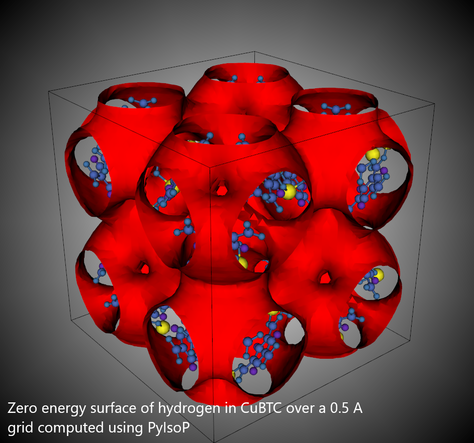
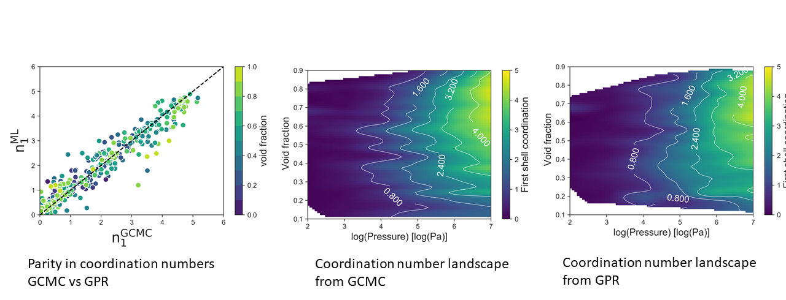

.. _theory:

===============================================================
Theoretical Background
===============================================================

In this section we provide the theoretical background and the derivation
for the equations used in PyIsoP. Please refer to the original
publication from Gopalan *et al.*, :cite:`gopalan2019fast` for more explanation.

.. _llc:

The Local Langmuir constant (:math:`K_L`)
===============================================

The free energy of adsorption for a spatially distinct site :math:`i`
inside a material is given by Snurr *et al.* :cite:`snurr1994hierarchical`,

.. math:: 
   exp\Big({\frac{-A_{i}}{k_BT}}\Big)=\frac{1}{8 \pi^2V_{uc}}\int_iexp(-\frac{U_i}{k_BT})d^3rd^3\phi 
   :label: randyFE

where k\ :math:`_B` is the Boltzmann constant, and :math:`d^3r` and
:math:`d^3 \phi` represent the integral over the space forming the site
and the orientations of the adsorbate molecule respectively.
:math:`V_{uc}` simply serves as a volume scaling factor. For hydrogen
represented by a single site probe, adsorbing at a point (cubelet in
space with energy :math:`E_i`) equation :eq:`randyFE` reduces to,

.. math::
   exp(-\beta A_i)=\frac{V_{cubelet}}{V_{uc}}exp(-\beta E_i)
   :label: hsingle

where :math:`\beta = 1/k_BT`. Now, if there are :math:`n(E_i)` such
sites in a given volume V, the combined Henry’s constant resulting from
the adsorption in all these sites, each of energy :math:`E_i` will be

.. math::
   K_{H}(E_i,T)=\frac{M_A}{N_A}\frac{V_{uc}}{V}\frac{1}{k_BT}n(E_i)exp(-\beta A_i) \quad [mass/(pres. vol.)]
   :label: khE1

substitute equation :eq:`hsingle` in equation :eq:`khE1` to get

.. math::
   K_{H}(E_i,T)=\frac{M_A}{N_A}\frac{1}{k_BT}.\frac{V_{cubelet}.n(E_i)}{V}exp(-\beta E_i)
   :label: khE2

The resultant Langmuir constant from the adsorption in a site with the
energy :math:`E_i` is related to :math:`K_H(E_i)` as

.. math::
   K_L(E_i,T)=\frac{K_H(E_i)}{Q_{sat}(E_i)} \quad [1/pres.]
   :label: kl1

where :math:`Q_{sat}(E_i)` represents the overall saturation capacity
of all sites with the energy :math:`E_i`

.. math::
   Q_{sat}(E_i)=Q_{sat}*f_V(E_i)=Q_{sat}*\frac{n(E_i)V_{cubelet}}{V}
   :label: qsatE

where :math:`f_V(E_i)` is the fraction of the total void volume that is
formed by all sites of energy :math:`E_i`. Using equations :eq:`khE2` and
:eq:`qsatE`, equation :eq:`kl1` can be simplified to

.. math::
   K_L(E_i,T)=\frac{M_A}{RTQ_{sat}}exp(-\beta E_i)
   :label: kl2

.. _foa:

The Fundamental Equation of adsorption
===================================================

Adsorption of a pure component in a nanoporous material under a given set of conditions (T,P) can
be considered as a summation over all of its adsorption sites. Amongst all the possible ways to
characterize an adsorption site, one useful descriptor is its interaction energy with the
guest molecule. Now the overall adsorption in the material at any given T,P is the sum
over all the energetically different adsorption sites,

.. math::
   Q(T,P)=\sum_iQ_{sat}.f_V(E_i)\frac{K_L(E_i,T).P}{K_L(E_i,T).P+1}
   :label: qdiscrete

Now if we assume that there is a continuous distribution of such sites
in the material, which we can think in terms of a normalized probability density :math:`\rho(E)`.
This normalized density :math:`\rho(E)` is related to :math:`f_V(E_i)` (from equation :eq:`qsatE`), the fraction of the total void volume that is
formed by all sites of energy :math:`E`  as,

.. math::
   f_V(E)=\rho(E)dE
   :label: vfe
where :math:`f_V(E)` equals the probability of finding a site of energy between :math:`E` and :math:`E+dE` (once we assume a continuous distribution)  inside the box.
Hence the overall adsorption in the material can be expressed 
as a continuous integral involving the saturation loading :math:`Q_{sat}`, the local Langmuir constants :math:`K_L` and the 
density of sites :math:`\rho(E)`.

.. math::
   \frac{Q(T,P)}{Q_{sat}}=\int_{-\infty}^{\infty}\frac{K(T,E)*P}{1+K(T,E)*P}\rho(E)dE
   :label: fundamentalEOAET

To make accurate predictions at high pressures (order of 10 bar), the local Langmuir constant
should be corrected for the guest-guest contribution. Including the
guest-guest interactions into :math:`E` creates a pressure dependency in :math:`K_L`. We include that explicitly
to get

.. math::
   \frac{Q(T,P)}{Q_{sat}}=\int_{-\infty}^{\infty}\frac{K(T,P,E)*P}{1+K(T,P,E)*P}\rho(E)dE
   :label: fundamentalEOAETP

where the energy :math:`E` now includes both the contributions,

.. math::
   E=E^{(x,y,z)}_{guest-host}+E^{(T,P,material)}_{guest-guest}
   :label: Esplit
   
Calculation of the guest-host and guest-guest contributions, is explained in sections :ref:`guest-host` and :ref:`guest-guest` respectively.

.. _qst:

The Saturation capacity 
==========================
For hydrogen, the saturation loading can approximated as :cite:`simon2014optimizing`,

.. math::
   Q_{sat} = \rho_{L,H_2}*V_f = 70.8 (g/L) * V_f  

where :math:`\rm \rho_{L,H_2}` is the liquid density of hydrogen and :math:`V_f` is the void fraction of the material. 

.. _guest-host:

Guest-Host interactions 
==========================================

The guest-host energy can be easily calculated by dividing the material into cubelets and
calculating the energy of hydrogen placed at each position using a classical force field.
The histogram of this energy grid provides us with the density distribution of sites :math:`\rho(E)`
to use with equation :eq:`fundamentalEOAETP`.

.. _guest-guest:

Guest-Guest Interactions 
===========================================
The guest-guest interaction energy of hydrogen inside a nanopore on the other hand depends upon the
adsorption conditions (T,P) and the effects of confinement in the material. The difficulty in
understanding phase of hydrogen inside the nanopores of a material, under different adsorption
conditions, makes theoretical descriptions of the guest-guest interactions almost impossible. One
of the most useful descriptors of the local environment of molecules is the average first-shell
coordination number (:math:`n_1`) :cite:`waseda1980structure`. The coordination number for hydrogen in a
material at a given (T,P) can be calculated from GCMC simulation as the integral of the radial
distribution function (:math:`g(r)`) of hydrogen inside a nanopore.

.. math::
   n^{T,P}_1=\int_{r_0}^{r_1}4\pi r^2 dr\rho_bg(r)
   :label: n1rdf

where :math:`r_0` and :math:`r_1` correspond to the range of the first peak in :math:`g(r)` and :math:`\rho_b` is the overll box number
density. If we neglect all the interactions beyond the first coordination shell,
the average guest-guest energy can then be approximated in terms
of the first-shell coordination number and the Lennard Jones well-depth (:math:`\epsilon`) as

.. math::
  E^{T,P}_{guest-guest}=\frac{n_1^{T,P}*\epsilon}{2}
  :label: eggn1

Hence, in order to make predictions with the model we need a means to predict the coordination number of hydrogen
in a material at a given (T,P). For example in our recent study
:cite:`gopalan2019fast`, we trained a machine learning model which uses Gaussian Process Regression
(GPR_) :cite:`rasmussen2004gaussian`  with {log(P), T, void fraction (:math:`V_f`), the largest cavity diameter (LCD) and the pore
limiting diameter (PLD)} as the feature space. The model was trained on data from the GCMC
simulations performed on a set of 1000 representative MOFs from the CoRE-MOF (1.0_) :cite:`chung2014computation` The parity
between GCMC and GPR and the coordination number landscapes at 77 K are reproduced below. PyISoP
offers machine learning with the same settings (GPR, kernel: Rational Quadratic, Length-scale =
0.5) for quick training on your data. To use a different kernel or a machine learning algorithm one could use
Scikit-learn_   :cite:`pedregosa2011scikit` and feed the coordination number array into PyIsoP's :ref:`predictor` to make isotherm
predictions.

.. _Scikit-learn: https://scikit-learn.org/
.. _V1: https://pubs.acs.org/doi/abs/10.1021/cm502594j
.. _GPR: http://www.gaussianprocess.org/gpml/ 

.. _final:

Final Form of :math:`K_L`
=============================
If we put all the pieces together, the final expression of the local Langmuir constant to be used
in equation :eq:`fundamentalEOAETP` looks like

.. math::
   K_L(E^{bin}_{guest-host}, T, P) = exp\big({-\beta E^{bin}_{guest-host}}\big) \cdot exp({-\beta \frac{n^{T,P}_1\epsilon}{2}})

------------------------------

.. bibliography:: mybibliography.bib

